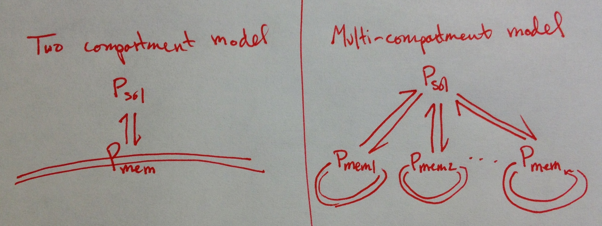

Figure 1: Multi-compartment simulation of permeabilization processes
====================================================================

**Figure 1A**. In the two-compartment approach adopted by prior modeling
studies, the pore forming protein P is partitions between two reaction
compartments, solution and membrane (:math:`P_{sol}` and :math:`P_{mem}`).  The
membrane compartment represents a continuum approximation of the many discrete
vesicles in the solution. In the multi-compartment approach, individual lipid
vesicles are enumerated as explicit compartments, and the pore forming protein
partitions among each of these.

